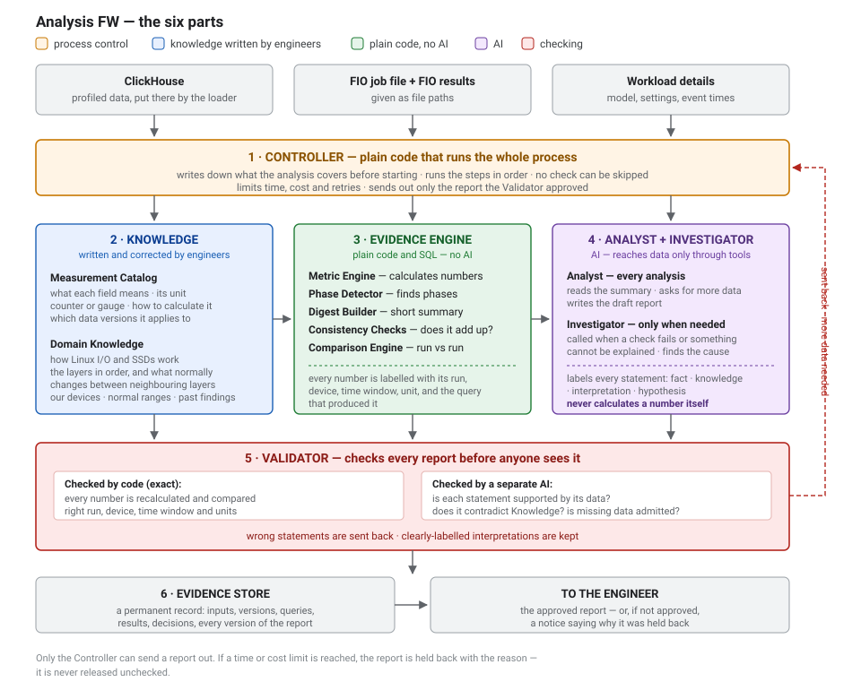
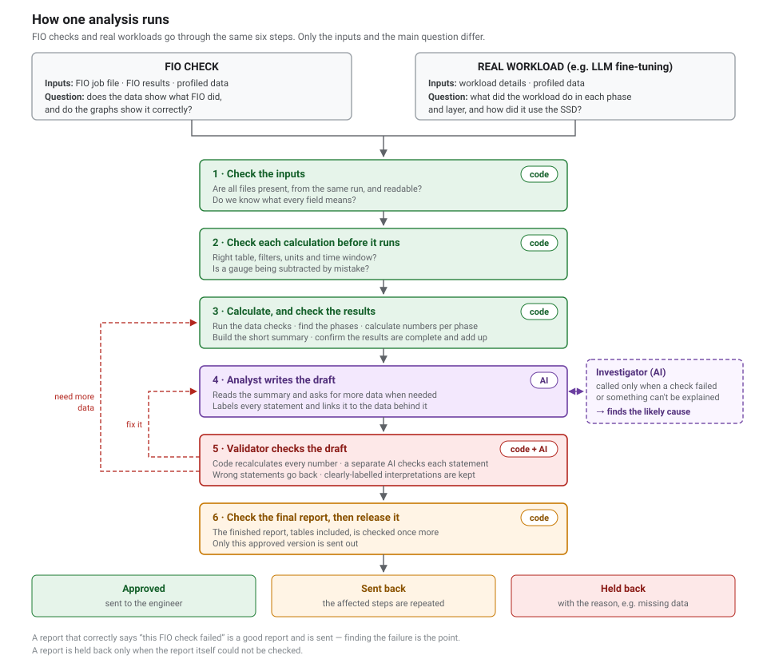

# Analysis FW — High-Level Architecture (Phase 2: automated reports)

> **Phase note (2026-10-09).** This architecture is for the **automated analysis
> reports**, which are now **Phase 2**. Phase 1 is plain-language requests to
> Grafana graphs (see [goals-and-requirements.md](goals-and-requirements.md)); its
> architecture will be written after the tool trial in
> [phase1-tool-research.md](phase1-tool-research.md). Much of this document carries
> over to Phase 1 — the Measurement Catalog, checking a query before it runs, and
> fixing the scope of a request.

**Status:** draft for review. The detailed (low-level) design comes after this is agreed.
**Based on:** the 12 Phase 2 goals in [goals-and-requirements.md](goals-and-requirements.md).
**Written for:** anyone joining the project. It assumes basic storage knowledge,
SQL and FIO — but nothing about this design.

This document covers only the new **analysis system**. The existing loader, which
puts profiling data into ClickHouse, is described in [architecture.md](architecture.md)
and does not change. Earlier drafts of this document are kept in [_history/](_history/).

---

## 1. What this system does

Today, after a profiling run, an engineer opens Grafana, studies many graphs, and
writes conclusions by hand. This system automates that work:

1. It reads the profiled data from ClickHouse.
2. Plain code calculates the numbers that the graphs show.
3. An AI language model explains what those numbers mean and writes a report.
4. A separate checker confirms every statement before the report reaches anyone.

It works in two modes:

- **FIO check** — run a known FIO workload, and confirm that the profiling, the
  database and the graphs are all correct.
- **Real workload analysis** — explain a workload we do not yet understand, such
  as LLM fine-tuning.

### 1.1 The main risk, and the main idea

AI language models write fluent, confident text — and they sometimes state wrong
numbers. We have promised never to give an engineer a wrong report.

So the whole design follows one idea: **code calculates, the AI explains.**

- Every number is calculated by SQL queries, never by the AI.
- The AI reads the finished numbers and explains them.
- Because every number comes from a known query, the checker can simply run that
  query again and compare.

*Example:* the report says "the SSD received 933K write I/Os". The checker re-runs
the query that produced 933K. If the answer differs, the report is sent back.

### 1.2 Words used in this document

| Word | Meaning |
|---|---|
| **Analyst** | The AI that studies the numbers and writes the draft report. |
| **Investigator** | A second AI role, used only when something looks wrong. It searches for the cause. |
| **Validator** | The checker. Partly code, partly a separate AI that never sees the Analyst's reasoning. It decides whether a draft is correct. |
| **Controller** | Plain code that runs each analysis step by step. The only part allowed to send a report out. |
| **Metric** | A named measurement with one fixed definition, such as "block-layer read IOPS". |
| **Measurement Catalog** | The list of every field and metric: what it means, its unit, and how to calculate it. |
| **Counter / gauge** | A *counter* only grows (total reads since boot) — subtract two samples to get a rate. A *gauge* is a current value (I/Os in flight right now) — never subtract it. |
| **Phase** | A stretch of a run with steady behaviour, such as "model load" followed by "checkpointing". |
| **Digest** | A compact table of the main numbers of a whole run, built by code, small enough for the AI to read. Not written text. |
| **Claim** | One statement in a report. Each is labelled: measured fact, domain knowledge, interpretation, or hypothesis. |
| **Fact record** | One calculated number together with its labels: run, device, time window, unit, and the query that produced it. |

---

## 2. Design rules

Eight rules shape everything else.

| # | Rule | What it means | Why |
|---|---|---|---|
| **1** | Code calculates, AI explains | Every number in a report comes from a catalog metric, run as SQL. The AI never produces a number. | Any number can be checked by running the same query again. |
| **2** | One definition per metric | A metric is defined once. Grafana and the analysis both use that definition. | Otherwise a graph and a report can show different numbers for the "same" thing. |
| **3** | Calculate first, then ask the AI | Everything that can be calculated exactly is done before the AI starts. | The AI receives finished numbers, not millions of raw rows. |
| **4** | Label every statement | Each claim says what kind it is and which data it rests on. | Readers can tell what was measured and what was inferred, and the Validator can check it. |
| **5** | Nothing checks itself | The part that writes a report never approves it. | A writer who made a mistake tends to repeat it when checking its own work. |
| **6** | Read old runs with old definitions | Each run is read using the field definitions that applied when it was collected. | Field meanings change over time. Mixing them silently gives wrong comparisons. |
| **7** | The AI model can be swapped | The AI sits behind our own interface. | We can use a local model or a hosted API, and change later. |
| **8** | "Not enough data" is a valid answer | The system may say it cannot conclude something. | Better than a confident guess. |

---

## 3. The six parts



[Open the diagram at full size](diagrams/analysis-architecture.svg).

| # | Part | Built with | What it does, in one sentence | Main goals it serves |
|---|---|---|---|---|
| **1** | Controller | plain code | Runs each analysis step by step, and sends out only an approved report. | 4, 6, 12 |
| **2** | Knowledge | files written by engineers | Explains what the data means and how storage works. | 1, 2, 10 |
| **3** | Evidence Engine | SQL and plain code | Calculates every number and runs the data checks. | 3, 6, 7, 8, 10 |
| **4** | Analyst and Investigator | AI | Studies the numbers and writes the draft; investigates when something looks wrong. | 4, 5, 6, 8, 9 |
| **5** | Validator | plain code + a separate AI | Checks the draft before anyone sees it. | 11, 12 |
| **6** | Evidence Store | database or files | Keeps a permanent record of everything, so any report can be traced and repeated. | 10, 11, 12 |

All six run inside one application. **Sections 3.1 to 3.6 below use the same
numbers as the diagram** — 3.1 is part 1, 3.2 is part 2, and so on.

### 3.1 Controller

**What it is.** Plain code, no AI. It manages one analysis from start to finish.

**What it does.**

- **Writes down the scope before anything starts** — which run, which device,
  which layers, which time window, and which topics the report must cover.
  *Example:* run `ProfileData-finetune-20260910-101500`, device `nvme3`, layers
  syscall, block, NVMe and SSD, the whole run, and every topic in the manual
  fine-tuning report.
  This list then stays fixed. The Analyst cannot quietly switch to another device
  or time window, and the Validator checks against the same list.
- **Runs the steps in a fixed order** — the six steps in
  [Section 4](#4-how-one-analysis-runs). No step can be skipped. For example, the
  Analyst cannot start writing conclusions before the data checks have run.
- **Sets limits.** The Analyst works in a loop: look at a result, ask for more
  data, look again. Each request for data is called a *tool call*. Without limits
  this loop could run for a long time or cost a lot. So the Controller caps the
  number of tool calls, the number of correction rounds, the total time and the
  total cost. If a limit is reached, the report is **held back with a reason** —
  it is never sent out unchecked just because time ran out.
- **Sends out only the approved version.** The Validator approves one exact
  version of a report. If anything changes afterwards — even one number — it must
  be checked again. Only the Controller sends a report out.

**Why it exists.** Without it, whether the checks run would depend on the AI
remembering to run them.

### 3.2 Knowledge

**What it is.** Information written and maintained by engineers, stored in this
repository. Adding or correcting it needs no code change.

It has two parts.

**Measurement Catalog** — one entry for every field and metric, saying:

- what it means, and its unit;
- whether it is a counter or a gauge;
- where in the kernel it is measured, so we know what it includes and what it misses;
- how to calculate it correctly;
- which versions of the data it applies to.

*Two example entries:*

- `in_flight_ios` (block layer) — I/Os in progress at the moment of sampling. A
  gauge, so never subtract it. Sampled once per second, so a short peak between
  two samples can be missed.
- `composite_temperature_kelvin` (SSD) — the drive temperature, **in Kelvin**.
  Without this entry, a report could say "318 degrees" when it means 45 °C.

**Domain Knowledge** — how Linux storage and SSDs behave, and facts about our
own systems: page cache and readahead, splitting and merging of I/O, SSD
internals such as garbage collection and write amplification, our devices
(capacity, queue count), normal value ranges, and past team findings.

Most of it is written text, for the AI to read. One small part is also kept as a
simple structured list, because **code** needs to read it too: the storage
layers in order (syscall → VFS → page cache → filesystem → block → NVMe → SSD),
and what normally changes between two neighbouring layers.
*Example:* as requests pass from the block layer to NVMe, any request larger than
the device's limit (128 KB here) is split into smaller pieces. So NVMe can show
many more I/Os than block, but the **bytes** should still match. A consistency
check reads this list to know that "more I/Os at NVMe" is normal but "more bytes
at NVMe" is not.

**Both the Analyst and the Validator read the same Knowledge.** Every piece of it
carries three labels:

- **Source** — where it came from: a specification, kernel documentation, or a
  measured team finding.
- **Applies to** — when it is valid: for example, only this device model, or
  only kernel 6.8.
- **Version** — which revision it is. If it is corrected later, we can find the
  reports that used the old version.

**Why the catalog is kept separately.** Our study of HolmesGPT found that its
database connection shows the AI the column names and types, but *not* the
column descriptions. Descriptions kept only inside the database would never
reach the AI. So the catalog is separate, with its own lookup.

### 3.3 Evidence Engine

**What it is.** Plain code and SQL, no AI. It produces every number the report uses.

It has five parts:

| Part | What it does | Example |
|---|---|---|
| **Metric Engine** | Calculates a named metric for a chosen run, device and time window. | "Block read IOPS for run X, device `nvme3`, 10:00–10:05" |
| **Phase Detector** | Splits a run into phases and describes each one. | "10:00–10:04 mostly reads; 10:04–10:25 mostly writes" |
| **Digest Builder** | Collects the main numbers of the whole run into one compact table for the Analyst. | Totals per phase, size distributions, share of I/O per queue and per core |
| **Consistency Checks** | Checks that the data agrees with itself. | Do the size buckets add up to the total I/O count? |
| **Comparison Engine** | Compares two runs, or two time windows. | Before and after a firmware change |

None of these five parts uses AI. The sections below explain how each one works.

#### Metric Engine — what it needs from us, and what it calculates

**What it needs from us.** Two things, and both mostly exist already.

*1. One short catalog entry per field* — its meaning, unit, and whether it is a
counter or a gauge:

```yaml
- field: linux_block_1_stats.read_ios
  meaning: completed read I/Os since boot, from /sys/block/<dev>/stat
  unit: count
  kind: counter
```

That entry alone lets the engine build the **simple** metrics by itself. Because
`read_ios` is a counter, the engine knows the correct calculation is "later value
minus earlier value". From that one rule it can produce reads in a time window,
reads per second, or reads as a share of all I/O — with no one writing SQL. This
is what lets a new field be used without a code change.

These entries can be drafted automatically from the `.proto` files and
[Profile-code-flow.md](Profile-code-flow.md), then reviewed by an engineer, rather
than written from scratch.

*2. The SQL behind the existing Grafana panels* — for the **tricky** metrics,
which combine several fields or hide traps. A person writes these once, reviews
them, and stores them as they are. *Example:* per-second latency (see
[block-metrics.md](block-metrics.md)) needs three safeguards that are easy to miss:

1. convert to signed numbers first, because subtracting unsigned counters after a
   reset gives a huge wrong value;
2. treat a counter reset as zero, not as a negative number;
3. show "no data", not "0 ms", for a second with no I/O.

Ratios between layers, such as NVMe I/Os divided by block I/Os, are also written
by hand.

**What it calculates.** Requests come from two places:

- **A fixed baseline**, calculated for every analysis — essentially the numbers
  behind our Grafana graphs, for the whole run and for each phase.
- **Extra requests from the Analyst**, when it wants something specific (see the
  example in [3.4](#34-analyst-and-investigator)).

**What a request looks like.** *Metric `block.read_iops`, run
`ProfileData-finetune-…`, device `nvme3`, from 10:00 to 10:05.* The engine finds
the metric in the catalog, builds or loads its SQL, runs it on ClickHouse, and
returns the numbers with their labels.

**Counter or gauge is enforced.** The engine refuses to subtract a gauge, because
the result would be meaningless.

**Every number carries labels.** Each result is a fact record: the value, its
unit, the run, device and time window, which metric and query produced it, the
tolerance used, and any warnings — for example "counter reset detected" or
"result was cut short".

#### Phase Detector — how it finds phases

**Why phases matter.** A real workload changes during a run. A fine-tuning run
first loads the model (mostly reads), then saves checkpoints (mostly writes). One
average over the whole run hides both. So every main number is calculated
**per phase** as well as for the whole run.

**How it splits a run.** Plain rules, no AI. It looks at three things it can
measure every second: how much I/O there is, the read/write mix, and the average
I/O size.

1. Give each second a label: **idle** (almost no I/O), **read-heavy** (for
   example 80% or more reads), **write-heavy** (80% or more writes), or **mixed**.
2. Join neighbouring seconds with the same label into one stretch.
3. Merge very short stretches (for example under 10 seconds) into their
   neighbours, so a brief blip does not create a new phase.

**How it describes a phase.** With numbers, not words:

```
Phase 1  10:00:00–10:04:12  read-heavy   97% reads   avg 128 KB   190 IOPS
Phase 2  10:04:12–10:04:40  idle
Phase 3  10:04:40–10:25:03  write-heavy  99% writes  avg 126 KB   760 IOPS
```

**Who names it.** A name such as "model load" or "checkpointing" needs an
understanding of the workload, so the **Analyst** gives it — and the name is
labelled as an interpretation.

**Three more rules:**

- If the workload records its own event times (for example "checkpoint started at
  10:04:40"), those are used instead of the detected boundaries.
- Phases can repeat. Fine-tuning saves a checkpoint every few minutes, so each
  occurrence is kept separately rather than merged into one.
- The thresholds (80%, 10 seconds) are settings, not fixed truths. FIO runs are
  ideal for tuning them: we know exactly when each 5-minute workload and each
  1-minute sleep starts, so we can confirm the detector finds those boundaries.

#### Digest Builder — how the summary is made

**Made by code, not AI.** This matters: if the AI wrote the summary, the numbers
in it could be wrong, and Rule 1 ("code calculates, AI explains") would break at
the very first step.

**It is a table of numbers, not written text.** The builder sends a fixed list of
requests to the Metric Engine — for the whole run and for each phase — and puts
the results together:

```
run: ProfileData-finetune-...    device: nvme3    duration: 25m03s
layers present: syscall, block, nvme, ssd    missing: filesystem
data checks: 14 passed, 0 failed
phase 3 (write-heavy, 10:04:40–10:25:03):
  block   writes: 19.9K   sizes: 8 MB 68% · 4 KB 21% · 4 MB 9%
  nvme    writes: 933K    sizes: 128 KB 99%
  block→nvme write-count ratio: 46.9
  queues: q6 10% (highest) · 15 others 5–7% each
  ssd temperature: 44 → 51 °C
```

A whole run fits in a few hundred lines — small enough for the AI to read in full.
By default the digest holds the kind of numbers used in the manual fine-tuning
report: totals, percentages and per-phase values. Finer detail, such as
second-by-second values, is fetched only when the Analyst asks for it.

### 3.4 Analyst and Investigator

Both are AI. They reach the data only through tools that the Evidence Engine
provides, and neither ever calculates a number itself.

**The Analyst runs in every analysis.** It:

- reads the digest and the data-check results;
- decides what to look at next, and asks the Evidence Engine for more numbers;
- explains what happened, layer by layer and phase by phase;
- writes the draft report, labelling every statement:
  - **measured fact** — "99% of I/Os reaching the SSD were 128 KB";
  - **domain knowledge** — "Linux splits large requests into 128 KB pieces on this device";
  - **interpretation** — "this phase looks like checkpointing";
  - **hypothesis** — "more cores than queues may cause lock contention (not measured)";
- links each statement to the fact records behind it.

**What "deciding what to look at next" means — an example.** The Analyst chooses
its next question based on what the last answer showed. From the manual
fine-tuning report:

1. **It notices something.** The digest shows 19.9K writes at the block layer but
   933K at NVMe — 47 times more. That needs an explanation.
2. **It forms a guess:** large requests may have been split. To test it, it asks
   the Metric Engine for the write sizes at both layers, the block-layer split
   counter, and the total bytes at both layers.
3. **It reads the answers.** Block writes are mostly 8 MB; NVMe writes are 99%
   128 KB; the split counter is high; the bytes match.
4. **It asks for one more number:** "if every block write were cut into 128 KB
   pieces, how many NVMe writes would there be?" The Metric Engine calculates
   about 928K from the block size buckets. The real count is 933K — within 1%.
5. **It writes the finding:** "8 MB requests were split into 64 pieces of 128 KB;
   bytes match, so nothing was added or lost."

If the bytes had **not** matched in step 3, it would have decided differently —
splitting alone cannot create extra bytes — and asked about something else, or
handed the question to the Investigator.

This is why the Analyst cannot be replaced by a fixed script: each question
depends on the previous answer. Notice also that in step 4 the AI proposed the
calculation but the **Metric Engine did the arithmetic** — Rule 1 in action.

**The Investigator runs only when something looks wrong** — a data check failed,
or the Analyst found something it cannot explain. It searches for the cause
across every stage: the workload run, the profiling code, the data files, the
loader, the database, the queries, and the graphs. It may read everything,
including the Profile FW source code. It is kept separate so that normal
analysis stays fast.

**One Analyst, not several.** We do not split the Analyst into specialists for
queues, SSD, and so on — one AI with the right tools and knowledge covers them
all. We will split it only if testing shows a clear need. The Investigator is
separate for a different reason: it has a different job.

**Neither of them can** approve its own work, change the scope, or change the
required checks.

### 3.5 Validator

**What it is.** The checker. It reviews the work before any report reaches an
engineer. It is independent: it sees the statements and the evidence, but never
the Analyst's reasoning.

**Checks done by code** — exact, no AI:

- **Numbers.** Every number in the report is recalculated by running the same
  query again, and compared.
- **Scope.** The evidence must belong to the right run, device and time window,
  and use the right units.

**Checks done by a separate AI:**

- **Support.** Does the evidence actually support this statement, or does the
  statement go further than the evidence?
- **Knowledge.** Does the statement contradict the Knowledge?
- **Gaps.** Does the report admit which data was missing?

**What happens next.** Each check ends as passed, failed, or could not be
completed. The Controller acts on the result: approve, send back for correction,
or hold back with a reason.

**The Validator must not remove good insight.** Many of the most useful findings
are interpretations, not measurements. *Example:* "20 CPU cores share 16 NVMe
queues, so submissions may compete for a lock." No probe measures lock
contention — yet an SSD engineer wants to know this. A checker that allowed only
measured facts would delete it.

So the rule is: an interpretation or hypothesis **passes** if it is clearly
labelled as one, and nothing in the evidence or the Knowledge contradicts it. It
**fails** only if it pretends to be a measured fact, or the evidence says
otherwise.

**How we test the Validator.** We have no real "known bad" reports yet, so we
make some. Take a good report and change it on purpose — alter a number, swap
the device, widen the time window, present a guess as a fact, delete a warning —
and confirm the Validator catches every change. We also confirm it does *not*
reject correct, clearly-labelled interpretations. Both kinds of mistake are
measured.

### 3.6 Evidence Store

**What it is.** A permanent record of every analysis.

**What it keeps.** The inputs; the versions of the data definitions and Knowledge
used; every query and its full result; every claim; every Validator decision; and
every version of the report.

**Why it exists.**

- Any statement in a report can be traced back to the exact query and data
  behind it.
- Running the same analysis again on the same data should give the same result —
  the store lets us confirm that.
- If data, definitions or Knowledge change later, we can find which approved
  reports are affected.

HolmesGPT keeps large results in temporary files that are deleted when a request
ends. That is fine for managing the AI's working memory, but it is not a
permanent record — so we keep our own.

---

## 4. How one analysis runs



[Open the diagram at full size](diagrams/analysis-workflows.svg).

Both modes — FIO check and real workload — go through the **same six steps**. Only
the inputs and the main question differ.

| Step | What happens | Done by |
|---|---|---|
| **1. Check the inputs** | Are all the files present, from the same run, and readable? Do we know what every field means? | Controller and Validator (code) |
| **2. Check each calculation before it runs** | Is the query right — correct table, filters, units, time window? Is a gauge being subtracted by mistake? | Validator (code) |
| **3. Calculate, and check the results** | Run the data checks, find the phases, calculate the numbers, build the digest. Confirm the results are complete and add up. | Evidence Engine and Validator (code) |
| **4. Write the draft** | The Analyst reads the results, asks for more when needed, and writes a labelled draft. If something looks wrong, the Investigator is called. | Analyst / Investigator (AI) |
| **5. Check the draft** | The Validator checks every statement. If something is wrong, the draft goes back to step 4 to be fixed, or to step 3 for more data. | Validator (code + AI) |
| **6. Check the final report, then release it** | The final formatted report, tables included, is checked once more, then sent out. | Validator and Controller (code) |

Five of the six steps contain a check. Step 2 deserves a note: catching a wrong
query *before* it runs is far cheaper than finding a wrong number afterwards.

### 4.1 What differs between the two modes

| | FIO check | Real workload analysis |
|---|---|---|
| **Inputs** | FIO job file, FIO results, profiled data, Grafana panel queries | Workload and model details, profiled data, event times if available |
| **Main question** | Does the data show what FIO did — and do the graphs show it correctly? | What did the workload do in each phase and layer, and how did it use the SSD? |
| **What the report says** | Which checks passed, failed, or could not be done, with expected and observed values | Findings per phase and per layer, SSD behaviour, hypotheses, and missing data |

**Important:** a report that correctly says "this FIO check failed" is a **good**
report, and it is sent out — finding the failure is the whole point. A report is
held back only when the report *itself* could not be checked.

### 4.2 Rules for the checks

- Numbers are checked against independent reference calculations and test cases
  with known answers. Running the same wrong query twice proves nothing.
- If a code check fails, the AI's opinion cannot overrule it.
- The Analyst cannot change a required check or loosen a tolerance.
- If the data, definitions or Knowledge change after approval, the affected
  reports must be checked again.

---

## 5. Checked against a real report

The team's hand-written fine-tuning report is the benchmark. We traced each of
its 11 findings back to the data. **Every one can be produced from fields that
exist today** — this report needs no new profiling.

Table names are shortened below: `syscall_1` is `linux_syscall_1_stats`,
`block_1` is `linux_block_1_stats`, `block_2` is `linux_block_2_misc`, `nvme_1`
is `linux_nvme_1_stats`, and `ssd_1` is `linux_ssd_1_stats`.

| Finding in the report | Data it comes from | Produced by | Type of statement |
|---|---|---|---|
| 1. All I/O uses the mmap interface | `syscall_1.mmap_count` is high and read/write syscall counts are near zero, while `block_2` shows heavy I/O | Digest + Domain Knowledge | Interpretation — based on something being **absent** |
| 2–3. Block-layer size distribution | `block_2` size buckets (`read_4kb` … `read_gt_8mb`, `read_unaligned`, the `_range` fields) as a share of `read_bios` / `write_bios` | Metric Engine | Measured fact |
| 4. 99% of SSD I/O is 128 KB | `nvme_1.read_128kb` / `write_128kb` as a share of all NVMe I/Os | Metric Engine | Measured fact |
| 5. Splitting increases the I/O count 4× (reads) and ~45× (writes) | `block_2.read_bios` / `write_bios` compared with `nvme_1.read_ios` / `write_ios`; also `block_2.read_splits` / `write_splits` | Metric Engine (ratio between layers) | Measured fact + labelled explanation |
| 6. Average I/O size per phase | `nvme_1.read_kbs ÷ read_ios`, within each phase | Phase Detector + Metric Engine | Measured fact |
| 7. 6.4 GB read, 122 GB written | `nvme_1.read_kbs` / `write_kbs`, per phase | Metric Engine | Measured fact |
| 8. Outstanding I/Os ≤ 3, then ≤ 45 | `block_1.in_flight_ios` — a gauge sampled once a second, so this is the highest value **seen**, not necessarily the true peak | Metric Engine | Measured fact, with a sampling limit |
| 9a. 20 CPU cores, 16 NVMe queues | count of distinct `cpu_id` and `queue_id` in the NVMe per-core and per-queue tables | Metric Engine | Measured fact |
| 9b. …causing a synchronisation lock | **not measured by any probe** | Domain Knowledge | Hypothesis |
| 9c. Queue 13 carries 50% of load I/O | share of I/O per queue | Metric Engine | Measured fact |
| 10. Which LBA ranges are busiest, on a 4 TB drive | NVMe LBA-range table + drive capacity | Metric Engine + Domain Knowledge | Measured fact (capacity from Knowledge) |
| 11a. Temperature rises during checkpointing | `ssd_1.composite_temperature_kelvin` compared with NVMe write I/Os, per phase | Metric Engine | Measured fact (a correlation) |
| 11b. …because that phase is write-heavy | **not measured** | Domain Knowledge | Interpretation |

**Where the report says more than the data shows.** Some statements are stronger
than the evidence. The system must keep what is supported, and say what would be
needed for the stronger claim:

- A high mmap *call count* does not prove that *all* storage I/O went through mmap.
- A higher I/O count alone does not prove splitting — bytes, request sizes and the
  split counters must also agree.
- More cores than queues does not prove lock contention.
- A temperature rise during a write phase does not prove the writes caused it.
- The size buckets group I/Os by **size**, not by starting address. "Aligned —
  4 KB to 256 KB" says nothing about LBA alignment.

**Checking pays off straight away.** The report says reads went from 12.7K to
49.5K (3.9×, reported as 4×) and writes from 19.9K to 933K. That is **46.9×**, but
the report says 45×. The unrounded numbers may explain the gap — but this is
exactly the kind of mismatch the Validator settles with one query instead of a
meeting.

**Keep reports short.** The manual report is 11 tight points. A generated report
that buries the same content under warnings and references is worse, not safer.
Evidence is available on request; it does not fill the report.

---

## 6. What we borrow from existing tools

We studied existing AI analysis tools (`LLM-Implementation-Study.md` — to be added
to [reference/](reference/)). None does our job out of the box, but several have
ideas worth reusing.

| Tool | What we borrow | What we leave |
|---|---|---|
| **HolmesGPT** (open source; code reviewed) | The loop in which the AI asks for data, reads the result, and decides what to do next. Storing large results outside the AI's memory, with a pointer. Its ClickHouse connection. Its test setup. | Its Kubernetes and alert-handling parts. Its read-only safety check, which only matches text patterns — we use real database permissions instead. Its row limit, which limits what the AI *sees*, not what the database *scans*. Its default instruction to prefer recent data — our runs are historical. |
| **HolmesGPT's Prometheus support** | Keeping "list the metrics" separate from "describe one metric" — our catalog lookup works the same way. | Moving our data to Prometheus. |
| **Snowflake Cortex** (from its documentation) | Metric definitions that are actually used to run the calculation. A store of reviewed queries. Regression tests. | The product itself — it runs only inside Snowflake. |
| **Datadog Bits** (from its documentation) | Every hypothesis has a status — supported, contradicted, or unclear — and links to its evidence. Evidence against a hypothesis is kept, not thrown away. | The idea that an AI calling something "validated" proves the cause. |
| **Dynatrace** (from its documentation) | Put data into a common form before comparing it. Use known dependencies to rank causes — two things happening at the same time is not proof. | Its automatic discovery of system structure — we already know ours: it is the storage stack. |
| **InsightPilot** (research paper, EMNLP 2023) | The AI chooses what to analyse next; a separate engine computes the numbers. | — |
| **Panda** (research paper, CIDR 2024) | Combine calculated numbers with metric descriptions, expert documents, and a check of the final answer. | — |

In short: **we borrow the AI loop and the ideas; we build the Knowledge, the
Evidence Engine and the Validator ourselves.** No existing tool provides those
three for storage data, and they are where our requirements are strictest.

## 7. Use an existing framework, or build our own AI loop?

An existing framework such as HolmesGPT would give us part 4: the loop in which
the AI asks for data and reads the results. It would not give us the Knowledge,
the Evidence Engine, or the Validator — which is most of the work and most of the
risk. The study also found seven places where HolmesGPT would need changes for
our use, some of them affecting correctness.

**Recommendation:** keep the AI behind our own interface (Rule 7), and decide
with a short trial. Connect HolmesGPT to our real ClickHouse, add the catalog
lookup as a tool, and run one real analysis end to end. If it saves real effort,
use it; if adapting it costs about as much as writing our own loop, write our
own. Either way, the other five parts do not change.

## 8. What must be shown before we trust the reports

A good architecture does not by itself make reports correct. Before we rely on
the system, testing must show:

- **Correct reports** for reviewed FIO runs and real workload runs — including all
  11 topics of the manual report — where the expected findings were worked out
  independently and not shown to the Analyst.
- **Mistakes caught at the right step:** wrong arithmetic, wrong units, wrong run
  or phase, incomplete results, unsupported causes, contradictions.
- **Correct but limited findings accepted**, not rejected.
- **Changes handled properly:** a new table, a changed field meaning, a corrected
  piece of Knowledge, or changed run data each leads to the right updated
  findings, and old approvals are withdrawn.
- **Repeatability:** the same data gives the same report; engineer corrections
  are used; a report edited after approval is detected.

We measure both **missed errors** and **correct findings wrongly rejected**. A
checker that rejects everything is not safe — it is useless.

## 9. What is missing today

These do not exist yet, and this design needs them.

1. **The loader does not record which schema a run was loaded with.** Profile FW
   copies the `.proto` files into each run folder, so the loader knows the schema
   at load time — and then forgets it. `registry.py` even computes a fingerprint
   of the schema ([registry.py:353](../src/registry.py#L353)) but does not store it.
   *Why this matters:* suppose next month the unit of `read_kbs` changes, or a
   size bucket's boundary moves. Old runs and new runs then sit in the same table
   and look identical, and a comparison between them is silently wrong. This
   cannot be fixed later, because the information is gone — so it is worth
   storing one extra value now.
2. **No metric definitions exist yet.** A description of a graph tells us what it
   means; it does not tell us exactly how its number is calculated. The latency
   example in [3.3](#33-evidence-engine) shows why that difference matters. We
   need the SQL behind each existing Grafana panel.
3. **`device` is not yet in the common header.** Profile FW plans to move it there
   ([ADR-0003](decisions/0003-pb-wrapper-generic-format.md)). Until then, filtering
   by device works differently for each layer.
4. **No run registration or duplicate-load protection.** Loading the same run
   twice duplicates its rows ([ADR-0006](decisions/0006-mvp-append-only-ingest.md)).
5. **No "known bad" test data.** [3.5](#35-validator) explains how we create it by
   changing good reports and good runs on purpose.
6. **Timestamps have 1-second resolution.** This is fine for finding phases, which
   last minutes. The open question is whether timestamps are real clock time or
   time since boot ([roadmap.md](roadmap.md)) — time since boot would break phase
   detection.

## 10. Decisions already made

- **Same repository** as the loader, as a separate package run with
  `python -m analysis` — the same style as the loader
  ([ADR-0004](decisions/0004-src-layout-and-external-config.md)).
- **FIO inputs are given as file paths** — supplied by Run & Deploy FW, or by hand
  until that is automated. The paths used are recorded with each analysis.
- **The Investigator may read everything**, including Profile FW source code. The
  question that settles most layer-to-layer mismatches is "does this tracepoint
  really count what we think it counts?" — and only the source code answers it.
- **Both local AI models and hosted AI APIs are available.** This is less risky
  than it may seem: the most important checks — numbers and scope — are plain
  code, not AI.
- **One Analyst** rather than several specialists, unless testing shows a need.
  The Investigator stays separate because it has a different job.

## 11. Open questions

1. Should the Measurement Catalog become the single source of metric definitions
   for **both** the analysis and the Grafana panels? Recommended — it is the only
   way Rule 2 stays true when someone edits a dashboard.
2. What tolerance should each numeric check use, and is it fixed per check or per
   device?
3. Should each report also have a machine-readable version, so results can be
   tracked across runs?

## 12. Decisions to record as ADRs

An **ADR** (Architecture Decision Record) is a short file in
[decisions/](decisions/) that records one decision and the reason for it. Once
this architecture is agreed, these should be recorded. Numbers start at **0011**,
because 0008 and 0009 are already used on the `query` and `go_version` branches.

- **0011** — Only catalog metrics produce numbers; the AI never does (Rule 1). The
  whole checking design depends on this.
- **0012** — Each metric has one definition, used by both Grafana and the analysis
  (Rule 2).
- **0013** — Every report is checked by an independent Validator that never sees
  the Analyst's reasoning, and only the Controller sends reports out (Rule 5).
- **0014** — The AI sits behind our own interface; whether to use an existing
  framework is decided by a trial (Rule 7).
- **0015** — Each run is read using the definitions that applied when it was
  loaded (Rule 6).
