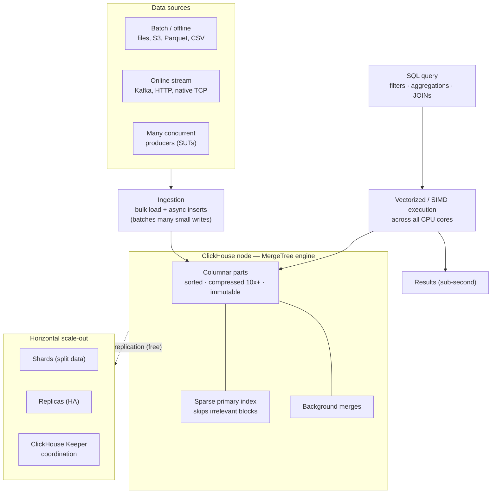

# ClickHouse — Database Selection & Overview

*Analytical data store for the System Analysis Framework*
*Audience: Engineering leadership & implementation team · Status: Decision recorded*

---

## Contents

1. [Introduction](#1-introduction)
2. [Database comparisons](#2-database-comparisons)
3. [ClickHouse overview & architecture](#3-clickhouse-overview--architecture)
   - [3.1 Overview](#31-overview) · [3.2 Architecture](#32-architecture) · [3.3 Capabilities & features](#33-capabilities--features) · [3.4 APIs](#34-apis-it-provides) · [3.5 Benchmarks](#35-benchmarks) · [3.6 Open-source vs paid](#36-open-source-vs-paid-version) · [3.7 Adopters](#37-current-adopters)
4. [How to deploy ClickHouse](#4-how-to-deploy-clickhouse)
5. [References](#5-references)

---

## 1. Introduction

**Purpose.** This document records the selection of the analytical database for the **System Analysis Framework** and provides a focused technical overview of the chosen engine, **ClickHouse**.

**Objective.** To:
1. Compare the candidate time-series / analytical databases against the parameters that matter for the framework;
2. State and justify the database decision; and
3. Give the implementation team a practical overview of ClickHouse — its architecture, capabilities, APIs, benchmarks, editions, adopters, and deployment options.

The framework collects high-volume host- and SSD-domain trace and telemetry data from multiple systems under test (SUTs) and must store it for overhead and behaviour analysis. The database must fit that workload: high-cardinality event ingestion, cross-layer correlation, ad-hoc analysis, and free horizontal scaling.

---

## 2. Database comparisons

**Scope.** Compare **ClickHouse, QuestDB, Prometheus, InfluxDB, TimescaleDB, GreptimeDB, and Elasticsearch** against 15 parameters relevant to the framework.

**Legend:** ✓ = meets well · ◐ = partial / with caveats · ✗ = does not meet.

| # | Parameter | ClickHouse | QuestDB | Prometheus | InfluxDB | TimescaleDB | GreptimeDB | Elasticsearch |
|---|---|---|---|---|---|---|---|---|
| 1 | High-cardinality trace ingestion | ✓ native | ◐ RAM cost | ✗ card. wall | ◐ v3 only | ◐ RAM cost | ✓ native | ◐ storage-heavy |
| 2 | Cross-layer correlation (JOINs) | ✓ full SQL | ◐ limited | ✗ none | ◐ limited | ✓ Postgres | ✓ SQL | ◐ weak |
| 3 | Ad-hoc queries | ✓ | ✓ | ◐ metrics only | ◐ | ✓ | ✓ | ◐ query DSL |
| 4 | Free horizontal scaling | ✓ Apache-2.0 | ✗ paid | ✗ single-node | ✗ paid | ✗ removed | ✓ Apache-2.0 | ✓ AGPL |
| 5 | Batch ingestion (online) | ✓ async inserts | ✓ | ◐ pull/scrape | ✓ | ◐ | ✓ | ✓ bulk API |
| 6 | HA deployment (replication/failover) | ✓ Keeper | ◐ paid | ◐ dup instances | ◐ paid | ✓ Postgres HA | ✓ | ✓ native |
| 7 | Offline bulk file loading (optimized) | ✓ file/S3 fns | ✓ CSV/Parquet | ✗ | ◐ CSV | ✓ COPY | ✓ Parquet | ◐ via tooling |
| 8 | Native online-stream ingestion | ✓ Kafka engine | ✓ line protocol | ◐ remote-write | ✓ Telegraf | ◐ external | ✓ Kafka | ✓ Beats/Logstash |
| 9 | Multi-producer fan-in (concurrent writers) | ✓ scales out + async inserts | ◐ 1 free node | ◐ pull model | ◐ 1 free node | ◐ single primary | ✓ scales out | ✓ scales out |
| 10 | High-performance read/write | ✓ | ✓ (single node) | ◐ metrics only | ◐ | ◐ | ✓ | ◐ slow aggs |
| 11 | Automatic deployment support | ✓ K8s operator | ◐ MN paid | ◐ needs Thanos/Mimir | ◐ paid | ◐ PG operators | ◐ younger operator | ✓ mature ECK operator |
| 12 | Retention policies | ✓ TTL | ✓ TTL | ✓ time-based | ✓ | ✓ retention policies | ✓ TTL | ✓ ILM |
| 13 | Continuous queries | ✓ mat. views | ✓ mat. views | ✓ recording rules | ✓ tasks | ✓ continuous aggregates | ✓ flows | ◐ transforms |
| 14 | Downsampling (LTTB) | ✓ native `lttb` | ◐ SAMPLE BY | ✗ | ◐ not LTTB | ✓ `lttb` toolkit | ◐ not LTTB | ◐ TSDS, not LTTB |
| 15 | Data model | Columnar (MergeTree) | Columnar, time-ordered | Per-series TSDB | TSM (v1) / Parquet (v3) | Postgres rows + columnar | Columnar (Parquet/S3) | Inverted index (Lucene) |

### Notes on the cells (reference for readers)

- **Row 1 — how each engine pays for high cardinality:** **✓ native** (ClickHouse, GreptimeDB) = stored as ordinary columns, no series-explosion penalty; **◐ RAM cost** (QuestDB, TimescaleDB) = dictionary/index must fit in memory; **◐ storage-heavy** (Elasticsearch) = inverted index swells disk + heap; **◐ v3 only** (InfluxDB) = fixed in v3, v1/v2 hit the wall; **✗ card. wall** (Prometheus) = one series per unique value → memory exhaustion.
- **Row 3 — "query DSL":** Elasticsearch is queried mainly via a JSON Domain-Specific Language, not full SQL — flexible for search, weaker for analytical/JOIN queries.
- **Row 5 — "async inserts":** a ClickHouse feature that buffers many small live inserts and writes them as one efficient batch. ✓ rates how efficiently the engine absorbs a high rate of live writes (Elasticsearch does this via its "bulk API"); it does not imply other engines lack inserts.
- **Row 6 — HA terms:** HA = staying up when a node fails. "Keeper" = ClickHouse's replication coordinator; "Postgres HA" = TimescaleDB inherits PostgreSQL's replication/failover tooling; "native" = built into the engine (Elasticsearch, GreptimeDB). Every ✓ provides HA — the note says how.
- **Row 9 — fan-in:** every engine accepts concurrent writes; this rates how well it *scales* as producers grow. **✓ scales out** (ClickHouse, GreptimeDB, Elasticsearch) spread writes across nodes and are comparable — none uniquely better; the ◐ engines cap at one free write node (or, for Prometheus, use a pull/scrape model). On a single node all are similar — ClickHouse uses async inserts to absorb many small-insert clients.
- **"Scales out" — manual vs automatic:** ClickHouse (OSS) uses **explicit sharding** (you define topology + sharding key; adding a node needs planned redistribution — more control, more effort); Elasticsearch and GreptimeDB use **automatic distribution** (the engine places and rebalances shards for you — less effort, less control).
- **Row 14 — Downsampling (LTTB):** ✓ = native LTTB (Largest-Triangle-Three-Buckets, a shape-preserving downsampling function); ◐ = has downsampling but time-bucket/average, not LTTB; ✗ = none.

### Decision of database

**ClickHouse (open-source, Apache-2.0) is selected.** It is the only engine that meets **every** parameter and is ✓ on all the framework's *hard constraints* — high-cardinality ingestion (1), cross-layer JOINs (2), free horizontal scaling (4), offline bulk loading (7), and multi-producer fan-in (9). **GreptimeDB** is the closest alternative (it clears the requirements on paper) but is set aside on **maturity**, not capability — younger project, smaller community, fewer production references — and is the primary candidate to re-evaluate in future. **Elasticsearch** scores well on scaling/HA/deployment maturity but poorly on JOINs and analytical-read cost. The remaining engines each fail at least one hard constraint: **QuestDB / InfluxDB / TimescaleDB** on free scaling (4), and **Prometheus** on the event/JOIN data model (1, 2).

---

## 3. ClickHouse overview & architecture

### 3.1 Overview

ClickHouse is a general-purpose, **column-oriented OLAP database** built for running arbitrary SQL over billions of events in sub-second time. It originated at Yandex.Metrica (a web-analytics product) to let analysts ask *any* question over a massive, ever-growing stream of events when the questions are not known in advance — the same shape as our overhead-analysis workload. It is open-source under Apache-2.0, runs as a single binary on one machine, and scales out for free to a sharded, replicated cluster.

### 3.2 Architecture

**How it works:** data arrives via batch loads or streams (or many concurrent producers); the **MergeTree** engine stores it as sorted, compressed, immutable **columnar parts**; a **sparse primary index** lets queries skip irrelevant data; queries run with **vectorized (SIMD)** execution across all CPU cores and support full SQL including **JOINs**; and the whole thing **shards and replicates** across nodes, coordinated by **ClickHouse Keeper**.



*ASCII fallback (identical structure):*

```
                         DATA SOURCES
     ┌──────────────┬──────────────┬────────────────────┐
     │ Batch/offline│ Online stream│ Many concurrent     │
     │ files, S3,   │ Kafka, HTTP, │ producers (SUTs)    │
     │ Parquet, CSV │ native TCP   │                     │
     └──────┬───────┴──────┬───────┴─────────┬───────────┘
            └──────────────┼─────────────────┘
                           ▼
            ┌────────────────────────────────┐
            │  INGESTION                      │
            │  bulk load + async inserts      │
            │  (batches many small writes)    │
            └───────────────┬────────────────┘
                            ▼
   ┌────────────────────────────────────────────────┐
   │  ClickHouse node — MergeTree engine             │
   │  • Columnar parts: sorted, compressed 10x+      │
   │  • Sparse primary index (skips blocks)          │
   │  • Background merges                             │
   └───────────────────────┬────────────────────────┘
        SQL query ──►  Vectorized / SIMD execution
      (filters,        across all CPU cores  ──► Results (sub-second)
       aggregations,
       JOINs)
                            │  sharding + replication (free)
                            ▼
   ┌────────────────────────────────────────────────┐
   │  SCALE-OUT:  Shard 1 | Shard 2 | ... | Shard N  │
   │  Replicas (HA)   +   ClickHouse Keeper          │
   └────────────────────────────────────────────────┘
```

**Why this design fits time-series / high-volume data:** columnar storage reads only the columns a query needs and compresses similar values 10×+; the sparse index and time-based partitioning let a query scan only the relevant slice (so query speed depends on data *scanned*, not data *stored*); immutable parts make writes pure sequential appends (fast); and JOINs across per-layer tables enable cross-layer correlation. The one trade-off — poor at single-row updates and tiny inserts — does not affect us, because trace data is written once and bulk-loaded in batches.

### 3.3 Capabilities & features

- **Columnar storage (MergeTree family)** — sorted, compressed, immutable parts; per-column codecs (Delta, DoubleDelta, Gorilla, ZSTD).
- **Full SQL** — filters, aggregations, window functions, and **JOINs**; ANSI-SQL-like dialect.
- **Vectorized (SIMD) execution** — processes data in batches across all cores and cluster nodes.
- **Free horizontal scaling** — sharding + replication built into the Apache-2.0 release.
- **High availability** — ReplicatedMergeTree + ClickHouse Keeper.
- **Flexible ingestion** — bulk file/S3 loading, async inserts for many concurrent clients, and integration table engines (**Kafka**, S3, MySQL, PostgreSQL, URL).
- **Materialized views** — incremental, insert-time roll-ups (continuous aggregation).
- **TTL** — automatic data expiry, downsampling, and hot/cold tiering for retention.
- **Native `lttb`** — shape-preserving downsampling for graphs.
- **Dictionaries & LowCardinality** — optimizations for lookups and low-cardinality columns.
- **Rich function library** — arrays, maps, JSON, approximate aggregates, statistical functions.

### 3.4 APIs it provides

ClickHouse exposes several network interfaces so almost any client or tool can connect ([official interfaces docs](https://clickhouse.com/docs/interfaces/overview)):

| Interface | Default port | Best for |
|---|---|---|
| **HTTP / HTTPS** | 8123 / 8443 | `curl`, REST-style access, language libraries, quick integration |
| **Native TCP** (+ TLS) | 9000 / 9440 | Maximum throughput; `clickhouse-client` and official drivers |
| **MySQL wire protocol** | 9004 | Existing MySQL tools/BI clients |
| **PostgreSQL wire protocol** | 9005 | Existing PostgreSQL tools/BI clients |
| **gRPC** | 9100 | Service mesh, streaming results, versioned contracts |
| **Prometheus endpoint** | (configurable) | Scraping ClickHouse's own metrics |

- **Client libraries / drivers:** `clickhouse-client` (CLI), Python (`clickhouse-connect`), Go, Java, Node.js, plus **ODBC/JDBC**.
- **Programmatic ingestion & querying** is most commonly done over the **HTTP interface** (simple, firewall-friendly) or the **native protocol** (fastest) — both suit the framework's load-from-files pipeline and Grafana/Python analysis layer.

### 3.5 Benchmarks

> **Caveat:** most database benchmarks are vendor-published and each favours its own product. Figures below are **directional**, with the publisher noted.

**Write (ingest), single node — rows/sec:**

| Database | Ingest rate | Source |
|---|---|---|
| QuestDB | ~1.4M (peak) | [QuestDB](https://questdb.com/blog/clickhouse-vs-questdb-comparison/) |
| ClickHouse | ~0.9–4M (single node); **400M+/s on a free cluster** | [Tinybird](https://www.tinybird.co/blog/1b-rows-per-second-clickhouse), [Cloudflare](https://clickhouse.com/blog/how-cloudflare-processes-hundreds-of-millions-of-rows-per-second-with-clickhouse) |
| GreptimeDB | > ClickHouse (log benchmark) | [Greptime](https://greptime.com/blogs/2024-08-22-log-benchmark) |
| InfluxDB | ~334K (collapses on high cardinality) | [KX TSBS](https://kx.com/blog/benchmarking-kdb-x-vs-questdb-clickhouse-timescaledb-and-influxdb-with-tsbs/) |
| TimescaleDB | ~145K | [KX TSBS](https://kx.com/blog/benchmarking-kdb-x-vs-questdb-clickhouse-timescaledb-and-influxdb-with-tsbs/) |
| Elasticsearch | Slowest, highest resource use | [ClickHouse](https://clickhouse.com/blog/elasticsearch-log-analytics-clickhouse) |

**Read / analytics & storage:**

| Comparison | Result | Source (bias) |
|---|---|---|
| ClickHouse vs Elasticsearch | ClickHouse **2–6× faster** analytics, **12–19× less storage** | [ClickHouse](https://clickhouse.com/blog/clickhouse_vs_elasticsearch_the_billion_row_matchup) |
| ClickHouse vs Druid / Pinot | Pinot faster for *known* pre-indexed queries; ClickHouse wins ad-hoc SQL | [StarTree](https://startree.ai/resources/a-tale-of-three-real-time-olap-databases/) / [ClickBench](https://benchmark.clickhouse.com/) |
| ClickHouse vs TimescaleDB / InfluxDB | ClickHouse faster on analytical scans; ~15–30× compression | [sanj.dev](https://sanj.dev/post/clickhouse-timescaledb-influxdb-time-series-comparison/) |
| GreptimeDB vs ClickHouse | Roughly comparable reads; GreptimeDB better compression | [Greptime](https://greptime.com/blogs/2024-08-22-log-benchmark) |

**Takeaway:** ClickHouse is *not* the single-node ingest champion (QuestDB is faster), but that is not our bottleneck — we bulk-load from logs and scale writes out for free. On the axes that match our workload (analytical query speed, storage efficiency, full-SQL flexibility, free scaling) it leads or ties. The decisive test remains a run on our own trace data.

### 3.6 Open-source vs paid version

The core **engine is identical** in both; the differences are operational. **We use OSS (self-hosted).**

| Area | OSS (self-hosted) — *our choice* | ClickHouse Cloud (managed, paid) |
|---|---|---|
| License / cost | Apache-2.0, free (own infra only) | Consumption-based (compute + storage) |
| Core engine | Full columnar engine, full SQL | **Identical engine** |
| Storage / scaling | ReplicatedMergeTree; explicit sharding | SharedMergeTree (proprietary): object storage, autoscaling |
| Operations | Self-managed (backups, upgrades, HA) | Fully managed |
| Compliance certs | Self-certify your deployment | SOC 2, ISO 27001, HIPAA, PCI (managed) |
| Deployment | Any cloud, on-prem, **air-gapped** | AWS / GCP / Azure (+ BYOC) |

For a self-hosted, potentially air-gapped analysis system, OSS is the correct fit — full engine, full performance, free clustering, no loss of capability.

### 3.7 Current adopters

ClickHouse is proven for our exact workload class — high-volume machine-generated event/observability data:

| Use case | Adopters |
|---|---|
| Observability / logging (closest to us) | **Anthropic**, **Cloudflare** (~7M rows/s), **Uber**, **eBay**, **Sentry**, **OpenAI** (PB/day) |
| Product / web analytics | **PostHog**, **Plausible**, **Contentsquare**, **Spotify** |
| Finance / high-volume | **Bloomberg**, **Deutsche Bank**, **Ahrefs** (~1 EB uncompressed) |

*(Several figures are vendor-reported; see [References](#5-references).)*

---

## 4. How to deploy ClickHouse

ClickHouse OSS can be deployed several ways. **Overview of methods** (choose by environment; all are free):

| Method | What it is | Best for | Notes |
|---|---|---|---|
| **Single binary / local** | One self-contained executable (`curl` install script) | Quick start, dev, single-node, ad-hoc analysis | No package manager; simplest to try |
| **OS packages (deb / rpm)** | `apt` / `yum` install of `clickhouse-server` + `clickhouse-client` | Production on VMs / bare metal | Standard Linux service management |
| **Docker / Docker Compose** | Official `clickhouse/clickhouse-server` image | Containerized dev or small single/multi-node setups | Fast to stand up; reproducible config |
| **Kubernetes Operator** | Official [ClickHouse Operator](https://github.com/ClickHouse/clickhouse-operator) (CRD-based) | **Production multi-node, HA clusters** (recommended for the framework) | Automates cluster + Keeper lifecycle, scaling, upgrades; install via bundle YAML or Helm |
| **Managed (ClickHouse Cloud)** | Fully managed SaaS | Teams wanting zero ops | **Paid** — out of scope for our self-hosted plan |

**Notes for our deployment:**
- Replication/HA requires **ClickHouse Keeper** (or ZooKeeper) — the Kubernetes Operator provisions and manages it automatically.
- For a multi-node cluster fed by many SUTs, the **Kubernetes Operator** is the lowest-effort path to a highly-available, scalable deployment.
- For a first single-node stand-up (e.g. the initial analysis box), the **single binary** or **Docker** image is fastest.

*(Per the document scope, this is an overview of methods only; step-by-step install and cluster-configuration commands are covered in the official [installation docs](https://clickhouse.com/docs/install) and [operator guide](https://clickhouse.com/docs/clickhouse-operator/install/kubectl).)*

---

## 5. References

**Official ClickHouse**
- Interfaces / APIs overview — https://clickhouse.com/docs/interfaces/overview
- Installation — https://clickhouse.com/docs/install
- Kubernetes Operator (GitHub) — https://github.com/ClickHouse/clickhouse-operator
- Operator install guide — https://clickhouse.com/docs/clickhouse-operator/install/kubectl
- Asynchronous inserts (fan-in from many clients) — https://clickhouse.com/docs/optimize/asynchronous-inserts
- Sharding & write scale-out — https://clickhouse.com/docs/shards
- ClickHouse Cloud architecture — https://clickhouse.com/docs/cloud/reference/architecture
- SharedMergeTree — https://clickhouse.com/docs/cloud/reference/shared-merge-tree
- ClickBench (benchmark dashboard) — https://benchmark.clickhouse.com/
- Adopters — https://clickhouse.com/docs/about-us/adopters

**Scalability (production evidence)**
- Cloudflare — hundreds of millions of rows/sec — https://clickhouse.com/blog/how-cloudflare-processes-hundreds-of-millions-of-rows-per-second-with-clickhouse
- Cloudflare — HTTP analytics at 6M req/sec — https://blog.cloudflare.com/http-analytics-for-6m-requests-per-second-using-clickhouse/
- OpenAI — petabyte-scale observability — https://clickhouse.com/blog/why-openai-uses-clickhouse-for-petabyte-scale-observability
- Anthropic — observability for the AI era — https://clickhouse.com/blog/how-anthropic-is-using-clickhouse-to-scale-observability-for-ai-era
- Tinybird — 1B rows/sec in ClickHouse — https://www.tinybird.co/blog/1b-rows-per-second-clickhouse

**Benchmarks (note vendor bias)**
- KX — TSBS across QuestDB/ClickHouse/TimescaleDB/InfluxDB — https://kx.com/blog/benchmarking-kdb-x-vs-questdb-clickhouse-timescaledb-and-influxdb-with-tsbs/
- QuestDB vs ClickHouse — https://questdb.com/blog/clickhouse-vs-questdb-comparison/
- StarTree — ClickHouse vs Druid vs Pinot — https://startree.ai/resources/a-tale-of-three-real-time-olap-databases/
- GreptimeDB vs ClickHouse vs Elasticsearch (log engine) — https://greptime.com/blogs/2024-08-22-log-benchmark
- ClickHouse vs Elasticsearch (billion-row matchup) — https://clickhouse.com/blog/clickhouse_vs_elasticsearch_the_billion_row_matchup
- ClickHouse vs TimescaleDB vs InfluxDB (2026) — https://sanj.dev/post/clickhouse-timescaledb-influxdb-time-series-comparison/

**High-cardinality (Row 1 sources)**
- ClickHouse — the high-cardinality trap — https://clickhouse.com/resources/engineering/high-cardinality-slow-observability-challenge
- QuestDB — Symbol type — https://questdb.com/docs/concepts/symbol/
- Timescale — how databases handle high cardinality — https://medium.com/timescale/how-different-databases-handle-high-cardinality-data-a6e549ae704a
- Elastic Labs — time-series storage efficiency — https://www.elastic.co/search-labs/blog/time-series-data-elasticsearch-storage-wins
- GreptimeDB — unveiling high cardinality — https://greptime.com/blogs/2023-07-31-unveiling-high-cardinality

**Licensing**
- Elasticsearch is open source again (AGPLv3, 2024) — https://www.elastic.co/blog/elasticsearch-is-open-source-again
- TimescaleDB 2.14 (multi-node removed) — https://github.com/timescale/timescaledb/releases/tag/2.14.0

**Companion document**
- Full landscape, history, and detailed rationale: `Time-Series-Database-Decision.md`
